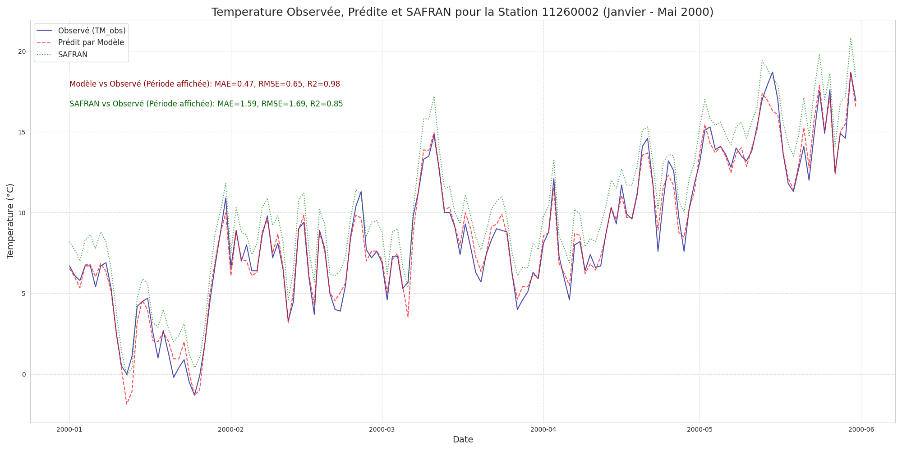
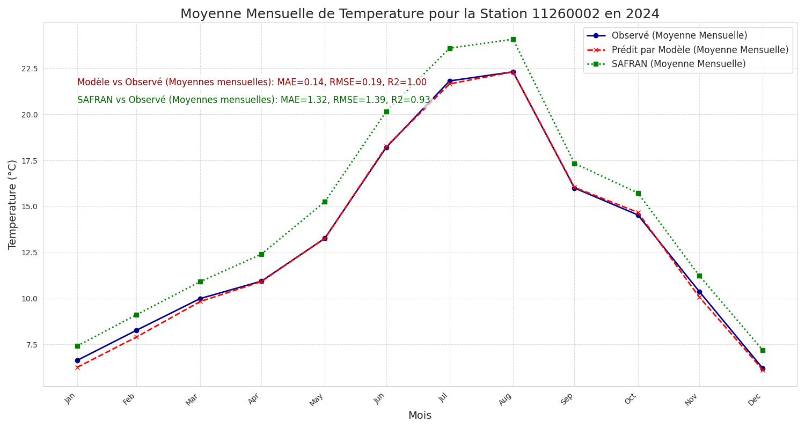
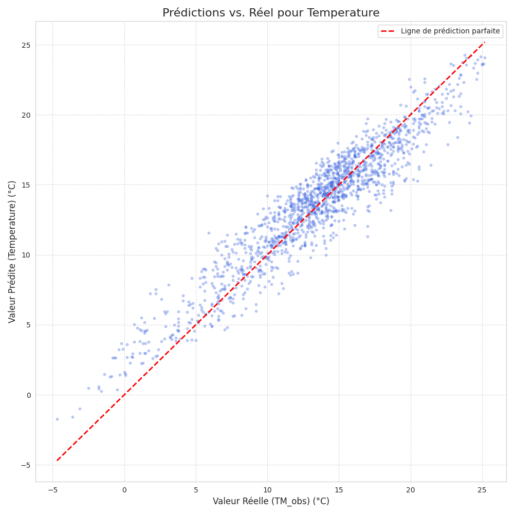
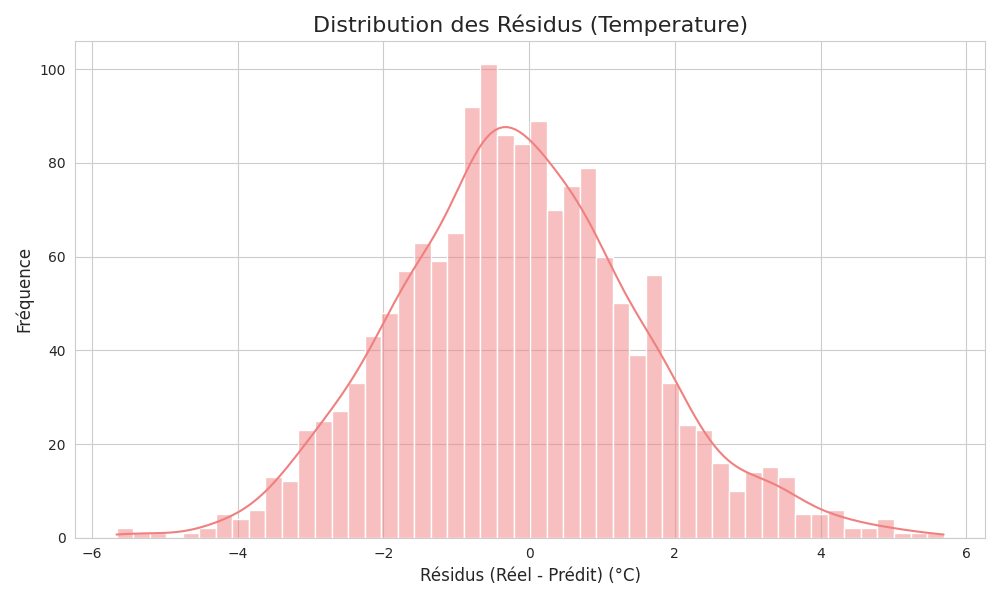
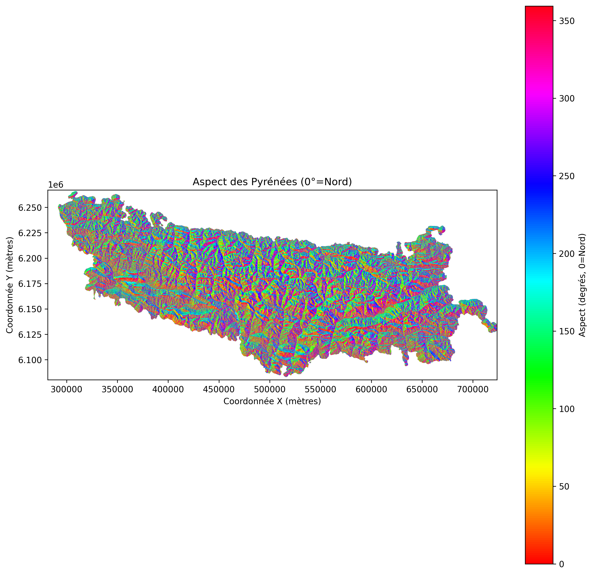

# Downscaling Climatique des Pyrénées par Machine Learning

**Auteur :** Salma Bensmail  
**Cadre :** Stage de Master 1 - CEFREM (Université de Perpignan), 2025

## Contexte et objectif

Ce projet vise à améliorer la résolution spatiale des données climatiques en zone de montagne complexe. Il compare les données de réanalyse standard (SAFRAN, maille de 8 km) avec un modèle de downscaling basé sur le Machine Learning, entraîné sur des données de stations in situ et des variables topographiques.

L’approche retenue repose principalement sur **LightGBM**, avec une évaluation comparative par rapport aux données SAFRAN brutes.

## Résultats de la modélisation

Le modèle de downscaling corrige efficacement les biais liés à l’altitude et à la topographie locale.

**Validation croisée sur 65 stations :**

| Métrique | Modèle LightGBM | Données SAFRAN brutes | Gain observé |
| :--- | :---: | :---: | :--- |
| **R² (Précision)** | 0.89 | -0.23 | Excellente corrélation locale |
| **MAE (Erreur moyenne)** | 1.33°C | 4.21°C | Erreur divisée par 3 |
| **RMSE (Erreur quadratique)** | 1.69°C | 5.55°C | Réduction massive des écarts |

## Visualisations

### Séries temporelles

### Qualité des prédictions

### Importance des variables

.png)

### Cartes

## Structure du code et reproductibilité

L’ensemble des traitements a été développé sous **Python 3.10** dans Google Colab.

**Stack technique :** `pandas`, `numpy`, `scikit-learn`, `geopandas`, `rasterio`, `lightgbm`.

### Pipeline principal (`scripts/`)

L’exécution suit les étapes suivantes :

1. [MNT_Cropping_pyrennees.ipynb](scripts/%20MNT_Cropping_pyrennees.ipynb) : découpage du MNT (SRTM) sur la zone d’étude.
2. [Métadonnées_IN_Situ_Stations_pyrénées_final.ipynb](scripts/%20M%C3%A9tadonn%C3%A9es_IN%20Situ_STations%20_pyr%C3%A9n%C3%A9es_final.ipynb) : extraction des métadonnées des stations.
3. [stations_statics_pyrenees.ipynb](scripts/%20stations_statics_pyrenees.ipynb) : filtrage spatial des stations.
4. [Intégration_des_données_Raster_Stations.ipynb](scripts/%20Int%C3%A9gration%20des%20donn%C3%A9es_Raster_Stations.ipynb) : croisement des données raster avec les stations.
5. [Prétraitement_Filtrage_Fully_Consolidated.ipynb](scripts/%20Pr%C3%A9traitement_Filtrage_Fully_Consolidated_Stations_Meteo_GIS_Data.ipynb) : nettoyage et consolidation.
6. [Données_SAFRAN_pyrénées_filtrées.ipynb](scripts/Donn%C3%A9es%20SAFRAN%20pyr%C3%A9nes_filtr%C3%A9es.ipynb) : préparation des données SAFRAN.
7. [Pipeline_préparation_Données_RandomForestFinal.ipynb](scripts/Pepeline_pr%C3%A9paration_Donn%C3%A9es_RandomForestFinal.ipynb) : modélisation et évaluation.

## Données et ressources

Seules les données légères nécessaires à la structure spatiale et à la démonstration sont incluses dans ce dépôt.

Les jeux de données bruts volumineux, comme SAFRAN complet ou certains produits MODIS, ne sont pas versionnés ici. Les scripts fournis permettent de reconstruire le pipeline de préparation à partir des sources officielles.

- SAFRAN : [Météo-France AERIS](https://www.aeris-data.fr/)
- MODIS (COT, CER, CWP) : [NASA EOSDIS Earthdata](https://earthdata.nasa.gov/)

## Documentation

- [Slides de la soutenance (PDF)](presentation/Slides_de_la_soutenance.pdf)

---

**Salma Bensmail – 2025**  
Université de Perpignan – CEFREM
